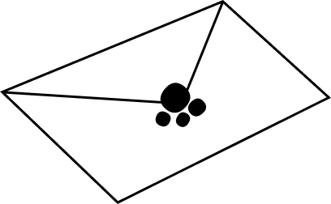

# 🐱 MeowMail - Ứng dụng Email thông minh

<div align="center">
  
  
  [](https://flutter.dev)
  [](https://dart.dev)
  [](https://firebase.google.com)
  
  **Ứng dụng email hiện đại với giao diện thân thiện và tính năng AI hỗ trợ**
</div>

## 📱 Giới thiệu

MeowMail là một ứng dụng email thông minh được phát triển bằng Flutter, mang đến trải nghiệm email hiện đại với giao diện đẹp mắt và nhiều tính năng hữu ích. Ứng dụng tích hợp AI để hỗ trợ soạn thảo email và quản lý thông tin cá nhân một cách dễ dàng.

### ✨ Tính năng chính

- 📧 **Quản lý Email**: Gửi, nhận, trả lời email với giao diện trực quan
- 🤖 **AI Assistant**: Hỗ trợ soạn thảo email thông minh
- 👥 **Tạo nhóm**: Quản lý danh sách liên hệ và tạo nhóm email
- 🔍 **Tìm kiếm**: Tìm kiếm email và người dùng nhanh chóng
- 📁 **Phân loại**: Quản lý email spam và thùng rác
- 🔐 **Bảo mật**: Đăng nhập an toàn với Google Sign-In
- 📎 **Đính kèm**: Hỗ trợ đính kèm file và hình ảnh
- 🌙 **Giao diện**: Thiết kế hiện đại với màu sắc vàng đặc trưng

## 📥 Tải xuống

### APK File
- **Phiên bản mới nhất**: v1.0.0
- **Kích thước**: ~50MB
- **Yêu cầu**: Android 5.0+ (API level 21)

[📱 Tải APK](https://github.com/MinhTruc09/MeowMail/releases/latest/download/mewmail.apk)

### QR Code để tải xuống
*QR Code sẽ được cập nhật sau*


## 📸 Hình ảnh ứng dụng

<div align="center">
  
  
  
  
  *Icon ứng dụng và các biểu tượng đặc trưng của MeowMail*
</div>

### 🎨 Thiết kế giao diện
- **Màu chủ đạo**: Vàng (#FFCA28), Đen, Trắng
- **Font chữ**: Borel (Google Fonts)
- **Biểu tượng**: Chủ đề mèo dễ thương với các icon paw, tail
- **Phong cách**: Hiện đại, thân thiện, dễ sử dụng

## 🚀 Hướng dẫn sử dụng

### 1. Cài đặt ứng dụng
1. Tải file APK từ link trên hoặc quét mã QR
2. Bật "Cài đặt từ nguồn không xác định" trong cài đặt Android
3. Mở file APK và làm theo hướng dẫn cài đặt

### 2. Đăng nhập
1. Mở ứng dụng MeowMail
2. Chọn "Đăng nhập bằng Google"
3. Chọn tài khoản Gmail của bạn
4. Cấp quyền truy cập cần thiết

### 3. Sử dụng cơ bản

#### 📧 Gửi email
1. Nhấn nút "+" ở góc dưới bên phải
2. Nhập địa chỉ email người nhận
3. Viết tiêu đề và nội dung
4. Nhấn "Gửi"

#### 🤖 Sử dụng AI Assistant
1. Khi soạn email, nhấn biểu tượng AI
2. Mô tả nội dung bạn muốn viết
3. AI sẽ gợi ý nội dung phù hợp
4. Chỉnh sửa và gửi email

#### 👥 Tạo nhóm
1. Vào menu "Tạo nhóm"
2. Nhập tên nhóm
3. Thêm thành viên bằng cách tìm kiếm email
4. Lưu nhóm để sử dụng sau

#### 🔍 Tìm kiếm
1. Sử dụng thanh tìm kiếm ở đầu màn hình
2. Nhập từ khóa hoặc địa chỉ email
3. Xem kết quả tìm kiếm

### 4. Quản lý tài khoản
- **Cập nhật thông tin**: Vào Settings > Thông tin cá nhân
- **Đổi mật khẩu**: Vào Settings > Đổi mật khẩu
- **Đăng xuất**: Vào menu drawer > Đăng xuất

## 🛠️ Cài đặt cho Developer

### Yêu cầu hệ thống
- Flutter SDK 3.7.2+
- Dart 3.0+
- Android Studio / VS Code
- Git

### Cài đặt
```bash
# Clone repository
git clone https://github.com/MinhTruc09/MeowMail.git
cd MeowMail

# Cài đặt dependencies
flutter pub get

# Chạy ứng dụng
flutter run
```

### Build APK
```bash
# Build APK release
flutter build apk --release

# Build APK debug
flutter build apk --debug
```

## 🏗️ Kiến trúc ứng dụng

```
lib/
├── main.dart                 # Entry point
├── models/                   # Data models
├── screens/                  # UI screens
├── services/                 # API services
├── utils/                    # Utilities
└── widgets/                  # Reusable widgets
```

## 🔧 Công nghệ sử dụng

- **Frontend**: Flutter, Dart
- **Backend**: MailFlow API
- **Database**: Firebase Firestore
- **Authentication**: Firebase Auth, Google Sign-In
- **Storage**: Firebase Storage
- **AI**: OpenAI Integration
- **State Management**: Provider/setState

## 📞 Liên hệ & Hỗ trợ

### 👨‍💻 Người tạo
**Nguyễn Minh Trực**
- 📧 Email: 2251120392@ut.edu.vn
- 🐱 GitHub: [@MinhTruc09](https://github.com/MinhTruc09)
- 🏫 Trường: Đại học Giao thông Vận tải

### 🆘 Hỗ trợ
- **Issues**: [GitHub Issues](https://github.com/MinhTruc09/MeowMail/issues)
- **Discussions**: [GitHub Discussions](https://github.com/MinhTruc09/MeowMail/discussions)
- **Email**: 2251120392@ut.edu.vn

## 📄 Giấy phép

Dự án này được phát hành dưới giấy phép MIT. Xem file [LICENSE](LICENSE) để biết thêm chi tiết.

## 🙏 Đóng góp

Chúng tôi hoan nghênh mọi đóng góp! Vui lòng:
1. Fork repository
2. Tạo branch mới (`git checkout -b feature/AmazingFeature`)
3. Commit changes (`git commit -m 'Add some AmazingFeature'`)
4. Push to branch (`git push origin feature/AmazingFeature`)
5. Tạo Pull Request

## 📈 Roadmap

- [ ] Thêm chế độ dark mode
- [ ] Hỗ trợ nhiều ngôn ngữ
- [ ] Tích hợp calendar
- [ ] Thông báo push
- [ ] Backup & sync
- [ ] Widget cho màn hình chính

---

<div align="center">
  
  
  **Made with ❤️ by Nguyễn Minh Trực**
  
  ⭐ Nếu bạn thích dự án này, hãy cho chúng tôi một star!
</div>
