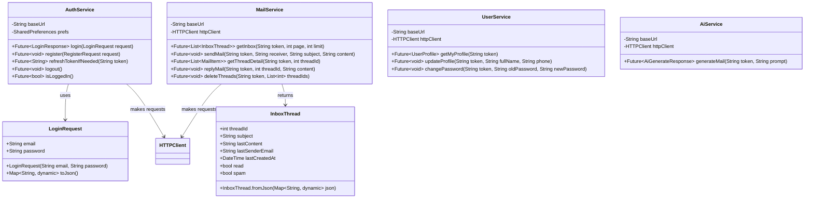
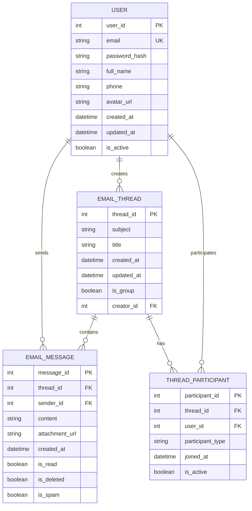
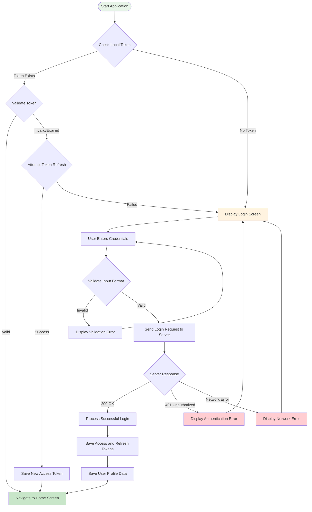
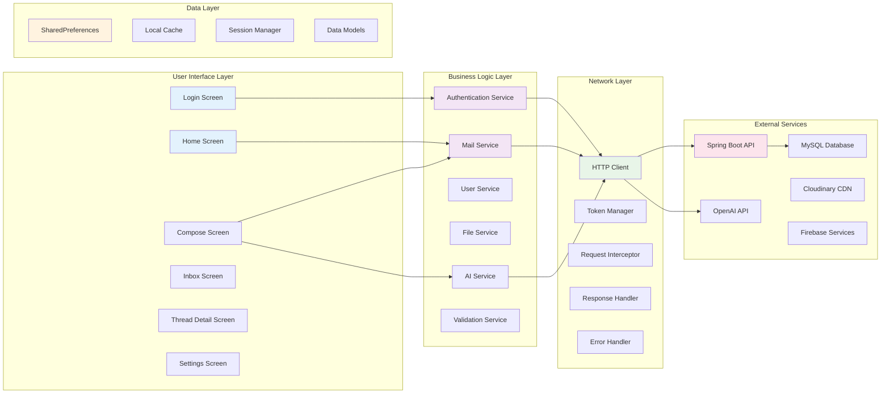
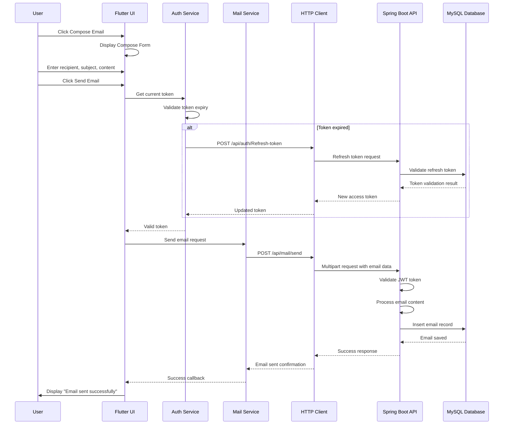

# MEWMAIL PROJECT - COMPLETE DIAGRAMS COLLECTION

## 1. USE CASE DIAGRAM

```mermaid
graph TB
    subgraph "MewMail Email System"
        subgraph "Authentication Management"
            UC1[Login to System]
            UC2[Register Account]
            UC3[Logout from System]
            UC4[Change Password]
            UC5[Reset Password]
        end

        subgraph "Email Management"
            UC6[Send Email]
            UC7[Receive Email]
            UC8[Reply to Email]
            UC9[Forward Email]
            UC10[Delete Email]
            UC11[Mark as Spam]
            UC12[Mark as Read/Unread]
            UC13[Search Emails]
            UC14[View Email Thread]
        end

        subgraph "File Management"
            UC15[Upload Attachment]
            UC16[Download Attachment]
            UC17[View Attachment]
        end

        subgraph "User Management"
            UC18[Update Profile]
            UC19[View Profile]
            UC20[Search Users]
        end

        subgraph "AI Integration"
            UC21[Generate Email Content]
            UC22[AI Email Suggestions]
        end

        subgraph "Group Management"
            UC23[Create Email Group]
            UC24[Manage Group Members]
        end
    end

    User[User]
    Admin[System Administrator]
    AIService[AI Service]
    EmailServer[Email Server]

    User --> UC1
    User --> UC2
    User --> UC6
    User --> UC21
    AIService --> UC21
    EmailServer --> UC6

    style User fill:#e3f2fd
    style Admin fill:#f3e5f5
    style AIService fill:#e8f5e8
    style EmailServer fill:#fff3e0
```

## 5. CLASS DIAGRAM

## 6. DATABASE ERD

## 2. AUTHENTICATION FLOWCHART

## 3. SYSTEM WORKFLOW CHART

## 4. EMAIL SENDING SEQUENCE DIAGRAM

