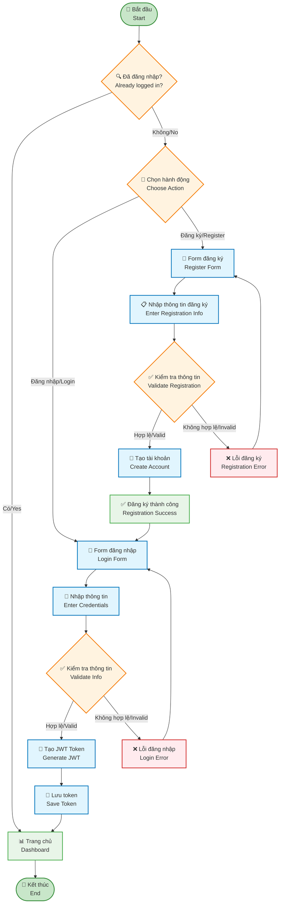

# MewMail System Diagrams - Draw.io Style

## 1. Use Case Diagram - Phong cách Draw.io

```mermaid
graph TB
    %% Actors
    User[👤 Người dùng<br/>User]
    Admin[👤 Quản trị viên<br/>Admin]
    
    %% System boundary
    subgraph MewMail["🏢 Hệ thống MewMail"]
        %% Authentication Use Cases
        UC1[📝 Đăng ký tài khoản<br/>Register Account]
        UC2[🔐 Đăng nhập<br/>Login]
        UC3[🔄 Đổi mật khẩu<br/>Change Password]
        UC4[👤 Cập nhật hồ sơ<br/>Update Profile]
        
        %% Email Use Cases
        UC5[✉️ Soạn email<br/>Compose Email]
        UC6[📨 Gửi email<br/>Send Email]
        UC7[📬 Xem hộp thư<br/>View Inbox]
        UC8[💬 Trả lời email<br/>Reply Email]
        UC9[🗑️ Xóa email<br/>Delete Email]
        UC10[🚫 Đánh dấu spam<br/>Mark as Spam]
        
        %% AI Use Cases
        UC11[🤖 Tạo email bằng AI<br/>Generate AI Email]
        UC12[💡 Gợi ý nội dung<br/>Content Suggestions]
        
        %% File Use Cases
        UC13[📎 Đính kèm file<br/>Attach Files]
        UC14[⬇️ Tải xuống file<br/>Download Files]
        
        %% Admin Use Cases
        UC15[📊 Quản lý người dùng<br/>Manage Users]
        UC16[📈 Xem thống kê<br/>View Statistics]
    end
    
    %% User connections
    User --> UC1
    User --> UC2
    User --> UC3
    User --> UC4
    User --> UC5
    User --> UC6
    User --> UC7
    User --> UC8
    User --> UC9
    User --> UC10
    User --> UC11
    User --> UC12
    User --> UC13
    User --> UC14
    
    %% Admin connections
    Admin --> UC15
    Admin --> UC16
    Admin --> UC2
    
    %% Styling
    classDef userClass fill:#E3F2FD,stroke:#1976D2,stroke-width:2px
    classDef systemClass fill:#FFF3E0,stroke:#F57C00,stroke-width:2px
    classDef usecaseClass fill:#F3E5F5,stroke:#7B1FA2,stroke-width:1px
    
    class User,Admin userClass
    class MewMail systemClass
    class UC1,UC2,UC3,UC4,UC5,UC6,UC7,UC8,UC9,UC10,UC11,UC12,UC13,UC14,UC15,UC16 usecaseClass
```



## 2. Authentication Flowchart - Phong cách Draw.io



## 3. Email Management Workflow - Phong cách Draw.io

```mermaid
flowchart TD
    Start([🚀 Khởi động ứng dụng<br/>App Start]) --> Auth{🔐 Đã xác thực?<br/>Authenticated?}
    
    Auth -->|Không/No| Login[🔑 Đăng nhập<br/>Login]
    Auth -->|Có/Yes| Inbox[📬 Hộp thư đến<br/>Inbox]
    
    Login --> Inbox
    
    Inbox --> Action{📱 Chọn hành động<br/>Choose Action}
    
    Action -->|Soạn mới/Compose| ComposeEmail[✉️ Soạn email<br/>Compose Email]
    Action -->|Xem email/Read| ReadEmail[👁️ Đọc email<br/>Read Email]
    Action -->|Tìm kiếm/Search| SearchEmail[🔍 Tìm kiếm<br/>Search Email]
    Action -->|Cài đặt/Settings| Settings[⚙️ Cài đặt<br/>Settings]
    
    %% Compose Email Flow
    ComposeEmail --> AIChoice{🤖 Sử dụng AI?<br/>Use AI?}
    AIChoice -->|Có/Yes| AIGenerate[🤖 Tạo nội dung AI<br/>AI Generate Content]
    AIChoice -->|Không/No| ManualWrite[✍️ Viết thủ công<br/>Manual Writing]
    
    AIGenerate --> ReviewContent[👀 Xem lại nội dung<br/>Review Content]
    ManualWrite --> ReviewContent
    
    ReviewContent --> AttachFile{📎 Đính kèm file?<br/>Attach Files?}
    AttachFile -->|Có/Yes| SelectFile[📁 Chọn file<br/>Select Files]
    AttachFile -->|Không/No| SendEmail[📤 Gửi email<br/>Send Email]
    
    SelectFile --> SendEmail
    SendEmail --> Success[✅ Gửi thành công<br/>Send Success]
    Success --> Inbox
    
    %% Read Email Flow
    ReadEmail --> EmailActions{📋 Hành động<br/>Email Actions}
    EmailActions -->|Trả lời/Reply| ReplyEmail[💬 Trả lời<br/>Reply]
    EmailActions -->|Xóa/Delete| DeleteEmail[🗑️ Xóa<br/>Delete]
    EmailActions -->|Spam| MarkSpam[🚫 Đánh dấu spam<br/>Mark Spam]
    EmailActions -->|Quay lại/Back| Inbox
    
    ReplyEmail --> ComposeEmail
    DeleteEmail --> Inbox
    MarkSpam --> Inbox
    
    %% Search Flow
    SearchEmail --> SearchResults[📋 Kết quả tìm kiếm<br/>Search Results]
    SearchResults --> Inbox
    
    %% Settings Flow
    Settings --> SettingsAction{⚙️ Cài đặt<br/>Settings Action}
    SettingsAction -->|Hồ sơ/Profile| UpdateProfile[👤 Cập nhật hồ sơ<br/>Update Profile]
    SettingsAction -->|Mật khẩu/Password| ChangePassword[🔒 Đổi mật khẩu<br/>Change Password]
    SettingsAction -->|Đăng xuất/Logout| Logout[🚪 Đăng xuất<br/>Logout]
    
    UpdateProfile --> Inbox
    ChangePassword --> Inbox
    Logout --> Start
    
    %% Styling
    classDef startEnd fill:#C8E6C9,stroke:#388E3C,stroke-width:3px
    classDef process fill:#E1F5FE,stroke:#0277BD,stroke-width:2px
    classDef decision fill:#FFF3E0,stroke:#F57C00,stroke-width:2px
    classDef success fill:#E8F5E8,stroke:#4CAF50,stroke-width:2px
    classDef main fill:#F3E5F5,stroke:#7B1FA2,stroke-width:2px
    
    class Start startEnd
    class Login,ComposeEmail,ReadEmail,SearchEmail,Settings,AIGenerate,ManualWrite,SelectFile,SendEmail,ReplyEmail,DeleteEmail,MarkSpam,SearchResults,UpdateProfile,ChangePassword,Logout process
    class Auth,Action,AIChoice,AttachFile,EmailActions,SettingsAction decision
    class Success,Inbox success
    class ReviewContent main

## 4. System Architecture Diagram - Phong cách Draw.io

```mermaid
graph TB
    %% User Layer
    subgraph UserLayer["👥 Lớp người dùng - User Layer"]
        MobileUser[📱 Người dùng di động<br/>Mobile User]
        WebUser[💻 Người dùng web<br/>Web User]
    end

    %% Frontend Layer
    subgraph FrontendLayer["🎨 Lớp giao diện - Frontend Layer"]
        FlutterApp[📱 Flutter App<br/>• Material Design 3<br/>• Provider State Management<br/>• HTTP Client]
        WebApp[🌐 Web Application<br/>• React/Angular<br/>• Responsive Design<br/>• PWA Support]
    end

    %% API Gateway
    subgraph APILayer["🚪 Lớp API - API Gateway"]
        APIGateway[🚪 API Gateway<br/>• Rate Limiting<br/>• Authentication<br/>• Load Balancing]
    end

    %% Backend Services
    subgraph BackendLayer["⚙️ Lớp dịch vụ - Backend Services"]
        AuthService[🔐 Authentication Service<br/>• JWT Token Management<br/>• User Registration<br/>• Password Security]

        EmailService[✉️ Email Service<br/>• Send/Receive Emails<br/>• Thread Management<br/>• Spam Detection]

        AIService[🤖 AI Service<br/>• OpenAI Integration<br/>• Content Generation<br/>• Smart Suggestions]

        FileService[📁 File Service<br/>• Cloudinary CDN<br/>• Upload/Download<br/>• File Validation]
    end

    %% Database Layer
    subgraph DatabaseLayer["🗄️ Lớp dữ liệu - Database Layer"]
        MySQL[(🗄️ MySQL Database<br/>• User Data<br/>• Email Threads<br/>• File Metadata)]

        Redis[(⚡ Redis Cache<br/>• Session Storage<br/>• Token Cache<br/>• Performance)]
    end

    %% External Services
    subgraph ExternalLayer["🌐 Dịch vụ bên ngoài - External Services"]
        OpenAI[🤖 OpenAI API<br/>• GPT Models<br/>• Content Generation]

        Cloudinary[☁️ Cloudinary CDN<br/>• File Storage<br/>• Image Processing]

        Firebase[🔥 Firebase<br/>• Push Notifications<br/>• Analytics]
    end

    %% Connections
    MobileUser --> FlutterApp
    WebUser --> WebApp

    FlutterApp --> APIGateway
    WebApp --> APIGateway

    APIGateway --> AuthService
    APIGateway --> EmailService
    APIGateway --> AIService
    APIGateway --> FileService

    AuthService --> MySQL
    AuthService --> Redis

    EmailService --> MySQL
    EmailService --> Redis

    AIService --> OpenAI
    FileService --> Cloudinary

    AuthService --> Firebase
    EmailService --> Firebase

    %% Styling
    classDef userLayer fill:#E3F2FD,stroke:#1976D2,stroke-width:2px
    classDef frontendLayer fill:#F3E5F5,stroke:#7B1FA2,stroke-width:2px
    classDef apiLayer fill:#FFF3E0,stroke:#F57C00,stroke-width:2px
    classDef backendLayer fill:#E8F5E8,stroke:#4CAF50,stroke-width:2px
    classDef databaseLayer fill:#FFEBEE,stroke:#D32F2F,stroke-width:2px
    classDef externalLayer fill:#F1F8E9,stroke:#689F38,stroke-width:2px

    class MobileUser,WebUser userLayer
    class FlutterApp,WebApp frontendLayer
    class APIGateway apiLayer
    class AuthService,EmailService,AIService,FileService backendLayer
    class MySQL,Redis databaseLayer
    class OpenAI,Cloudinary,Firebase externalLayer
```

## 5. Database ERD - Phong cách Draw.io

```mermaid
erDiagram
    USERS {
        int user_id PK "🔑 ID người dùng"
        varchar email UK "📧 Email"
        varchar password "🔒 Mật khẩu"
        varchar full_name "👤 Họ tên"
        varchar phone "📞 Số điện thoại"
        varchar avatar_url "🖼️ Ảnh đại diện"
        datetime created_at "📅 Ngày tạo"
        datetime updated_at "🔄 Ngày cập nhật"
    }

    EMAIL_THREADS {
        int thread_id PK "🔑 ID chuỗi email"
        varchar subject "📝 Chủ đề"
        datetime created_at "📅 Ngày tạo"
        datetime updated_at "🔄 Ngày cập nhật"
        boolean is_deleted "🗑️ Đã xóa"
        boolean is_spam "🚫 Spam"
    }

    EMAIL_MESSAGES {
        int message_id PK "🔑 ID tin nhắn"
        int thread_id FK "🔗 ID chuỗi"
        int sender_id FK "👤 ID người gửi"
        text content "📄 Nội dung"
        datetime sent_at "📤 Thời gian gửi"
        boolean is_read "👁️ Đã đọc"
        boolean is_ai_generated "🤖 Tạo bởi AI"
    }

    THREAD_PARTICIPANTS {
        int participant_id PK "🔑 ID người tham gia"
        int thread_id FK "🔗 ID chuỗi"
        int user_id FK "👤 ID người dùng"
        enum role "👥 Vai trò (TO/CC/BCC)"
        datetime joined_at "📅 Ngày tham gia"
    }

    FILE_ATTACHMENTS {
        int attachment_id PK "🔑 ID tệp đính kèm"
        int message_id FK "🔗 ID tin nhắn"
        varchar file_name "📁 Tên file"
        varchar file_url "🔗 URL file"
        varchar file_type "📄 Loại file"
        bigint file_size "📏 Kích thước"
        datetime uploaded_at "📤 Ngày tải lên"
    }

    USER_SESSIONS {
        int session_id PK "🔑 ID phiên"
        int user_id FK "👤 ID người dùng"
        varchar access_token "🎫 Access Token"
        varchar refresh_token "🔄 Refresh Token"
        datetime expires_at "⏰ Hết hạn"
        datetime created_at "📅 Ngày tạo"
    }

    AI_CONVERSATIONS {
        int conversation_id PK "🔑 ID cuộc trò chuyện"
        int user_id FK "👤 ID người dùng"
        text user_prompt "💭 Yêu cầu người dùng"
        text ai_response "🤖 Phản hồi AI"
        datetime created_at "📅 Ngày tạo"
    }

    %% Relationships
    USERS ||--o{ EMAIL_MESSAGES : "gửi/sends"
    USERS ||--o{ THREAD_PARTICIPANTS : "tham gia/participates"
    USERS ||--o{ USER_SESSIONS : "có phiên/has sessions"
    USERS ||--o{ AI_CONVERSATIONS : "trò chuyện/chats"

    EMAIL_THREADS ||--o{ EMAIL_MESSAGES : "chứa/contains"
    EMAIL_THREADS ||--o{ THREAD_PARTICIPANTS : "có người tham gia/has participants"

    EMAIL_MESSAGES ||--o{ FILE_ATTACHMENTS : "có tệp đính kèm/has attachments"

## 6. Sequence Diagram - Email Sending Process

```mermaid
sequenceDiagram
    participant U as 👤 Người dùng<br/>User
    participant F as 📱 Flutter App<br/>Frontend
    participant A as 🚪 API Gateway<br/>Gateway
    participant E as ✉️ Email Service<br/>Backend
    participant AI as 🤖 AI Service<br/>OpenAI
    participant D as 🗄️ Database<br/>MySQL
    participant C as ☁️ Cloudinary<br/>CDN

    Note over U,C: 🚀 Quy trình gửi email với AI - Email Sending with AI

    U->>F: 1. 📝 Mở màn hình soạn email<br/>Open compose screen
    F->>U: 2. 🎨 Hiển thị giao diện<br/>Show UI

    U->>F: 3. 🤖 Yêu cầu AI tạo nội dung<br/>Request AI content
    F->>A: 4. 🔗 POST /api/ai/generate<br/>API call
    A->>AI: 5. 🤖 Gọi OpenAI API<br/>Call OpenAI
    AI->>A: 6. ✨ Trả về nội dung<br/>Return content
    A->>F: 7. 📄 Nội dung được tạo<br/>Generated content
    F->>U: 8. 👀 Hiển thị nội dung AI<br/>Show AI content

    U->>F: 9. 📎 Chọn file đính kèm<br/>Select attachment
    F->>A: 10. 📤 POST /api/file/upload<br/>Upload file
    A->>C: 11. ☁️ Tải lên Cloudinary<br/>Upload to CDN
    C->>A: 12. 🔗 Trả về URL file<br/>Return file URL
    A->>F: 13. ✅ File đã tải lên<br/>File uploaded

    U->>F: 14. 📧 Nhấn gửi email<br/>Press send
    F->>A: 15. 📤 POST /api/mail/send<br/>Send email
    A->>E: 16. ⚙️ Xử lý gửi email<br/>Process sending

    E->>D: 17. 💾 Lưu thread mới<br/>Save new thread
    D->>E: 18. 🔑 Trả về thread_id<br/>Return thread_id

    E->>D: 19. 💾 Lưu message<br/>Save message
    D->>E: 20. ✅ Xác nhận lưu<br/>Confirm save

    E->>D: 21. 👥 Lưu participants<br/>Save participants
    D->>E: 22. ✅ Hoàn thành<br/>Complete

    E->>A: 23. ✅ Email đã gửi<br/>Email sent
    A->>F: 24. 🎉 Thông báo thành công<br/>Success notification
    F->>U: 25. ✅ Hiển thị thành công<br/>Show success

    Note over U,C: 🏁 Hoàn thành quy trình - Process Complete
```

## 7. Pseudo Code Algorithms - Phong cách đơn giản

### 7.1. 🔐 Thuật toán xác thực người dùng

```
THUẬT TOÁN: ĐĂNG_NHẬP_NGƯỜI_DÙNG
INPUT: email, password
OUTPUT: access_token, refresh_token hoặc error

BẮT_ĐẦU
    1. 📧 KIỂM_TRA email có hợp lệ không
       NẾU không hợp lệ THÌ
           RETURN "Email không hợp lệ"

    2. 🔍 TÌM_KIẾM user trong database theo email
       NẾU không tìm thấy THÌ
           RETURN "Tài khoản không tồn tại"

    3. 🔒 KIỂM_TRA password với BCrypt
       NẾU password sai THÌ
           RETURN "Mật khẩu không đúng"

    4. 🎫 TẠO_JWT_TOKEN
       access_token = JWT.create(user_id, 15_minutes)
       refresh_token = JWT.create(user_id, 7_days)

    5. 💾 LƯU_SESSION vào database
       session = {
           user_id: user.id,
           access_token: access_token,
           refresh_token: refresh_token,
           expires_at: now() + 15_minutes
       }

    6. ✅ RETURN {
           access_token: access_token,
           refresh_token: refresh_token,
           user_info: user.basic_info
       }
KẾT_THÚC
```

### 7.2. ✉️ Thuật toán gửi email

```
THUẬT TOÁN: GỬI_EMAIL
INPUT: sender_id, receiver_email, subject, content, files[]
OUTPUT: thread_id hoặc error

BẮT_ĐẦU
    1. 🔐 KIỂM_TRA_XÁC_THỰC sender_id
       NẾU không hợp lệ THÌ
           RETURN "Không có quyền truy cập"

    2. 👤 TÌM_KIẾM receiver theo email
       NẾU không tìm thấy THÌ
           RETURN "Người nhận không tồn tại"

    3. 🧵 TẠO_THREAD_MỚI
       thread = {
           subject: subject,
           created_at: now(),
           is_deleted: false,
           is_spam: false
       }
       thread_id = DATABASE.save(thread)

    4. 📄 TẠO_MESSAGE
       message = {
           thread_id: thread_id,
           sender_id: sender_id,
           content: content,
           sent_at: now(),
           is_read: false
       }
       message_id = DATABASE.save(message)

    5. 👥 THÊM_PARTICIPANTS
       FOR EACH participant IN [sender_id, receiver_id]
           participant_data = {
               thread_id: thread_id,
               user_id: participant,
               role: (participant == sender_id) ? "FROM" : "TO",
               joined_at: now()
           }
           DATABASE.save(participant_data)

    6. 📎 XỬ_LÝ_FILE_ĐÍNH_KÈM
       NẾU files[] không rỗng THÌ
           FOR EACH file IN files[]
               file_url = CLOUDINARY.upload(file)
               attachment = {
                   message_id: message_id,
                   file_name: file.name,
                   file_url: file_url,
                   file_type: file.type,
                   file_size: file.size
               }
               DATABASE.save(attachment)

    7. 🔔 GỬI_THÔNG_BÁO
       FIREBASE.send_notification(receiver_id, "Bạn có email mới")

    8. ✅ RETURN thread_id
KẾT_THÚC
```

### 7.3. 🤖 Thuật toán tạo email bằng AI

```
THUẬT TOÁN: TẠO_EMAIL_BẰNG_AI
INPUT: user_id, prompt, context
OUTPUT: generated_content hoặc error

BẮT_ĐẦU
    1. 🔐 KIỂM_TRA_XÁC_THỰC user_id
       NẾU không hợp lệ THÌ
           RETURN "Không có quyền truy cập"

    2. 📝 CHUẨN_BỊ_PROMPT
       system_prompt = "Bạn là trợ lý viết email chuyên nghiệp"
       full_prompt = system_prompt + "\n" +
                    "Ngữ cảnh: " + context + "\n" +
                    "Yêu cầu: " + prompt

    3. 🤖 GỌI_OPENAI_API
       TRY
           response = OPENAI.chat_completion({
               model: "gpt-3.5-turbo",
               messages: [
                   {role: "system", content: system_prompt},
                   {role: "user", content: prompt}
               ],
               max_tokens: 500,
               temperature: 0.7
           })
       CATCH error
           RETURN "Lỗi kết nối AI service"

    4. 📄 XỬ_LÝ_PHẢN_HỒI
       generated_content = response.choices[0].message.content

       NẾU generated_content rỗng THÌ
           RETURN "AI không thể tạo nội dung"

    5. 💾 LƯU_LỊCH_SỬ_AI
       conversation = {
           user_id: user_id,
           user_prompt: prompt,
           ai_response: generated_content,
           created_at: now()
       }
       DATABASE.save(conversation)

    6. ✅ RETURN {
           content: generated_content,
           suggestions: [
               "Thêm lời chào",
               "Thêm chữ ký",
               "Điều chỉnh tone"
           ]
       }
KẾT_THÚC
```
```
```
