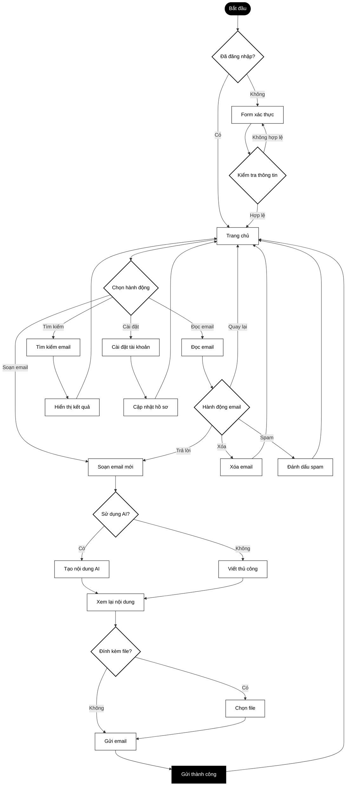
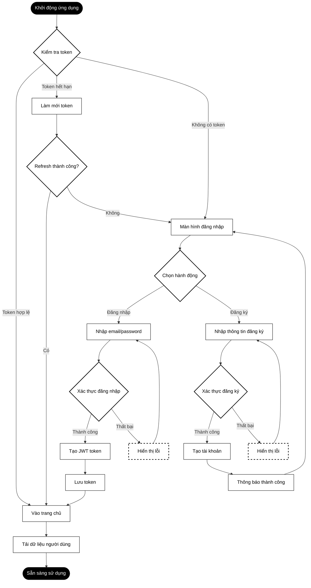
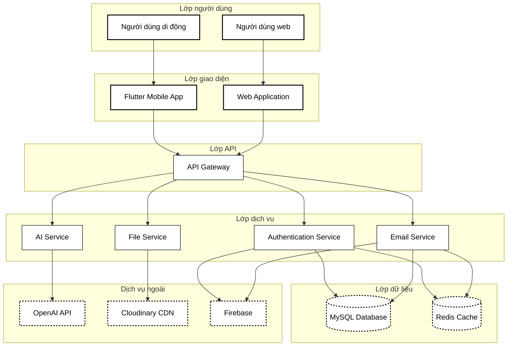
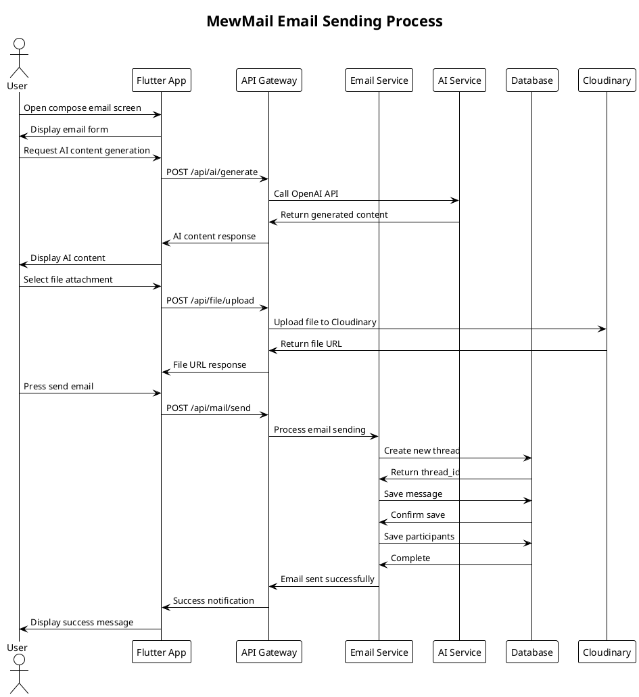

# MewMail Professional Diagrams - Black & White

## 1. Workflow Diagram - Quy trình làm việc



## 2. Flowchart - Sơ đồ luồng xác thực



## 3. Work Chart - Biểu đồ công việc hệ thống



## 4. PlantUML - Sequence Diagram


## 5. Pseudo Code - Mã giả

### Thuật toán đăng nhập

```
THUẬT TOÁN: ĐĂNG_NHẬP
ĐẦU VÀO: email, mật_khẩu
ĐẦU RA: token hoặc lỗi

BẮT ĐẦU
    // Kiểm tra định dạng email
    NẾU email không hợp lệ THÌ
        TRẢ VỀ "Email không đúng định dạng"

    // Tìm user trong database
    user = tìm_user_theo_email(email)
    NẾU user không tồn tại THÌ
        TRẢ VỀ "Tài khoản không tồn tại"

    // Kiểm tra mật khẩu
    NẾU mật_khẩu không khớp THÌ
        TRẢ VỀ "Mật khẩu sai"

    // Tạo token và lưu session
    token = tạo_jwt_token(user.id)
    lưu_session(user.id, token)

    TRẢ VỀ token
KẾT THÚC
```

### Thuật toán gửi email

```
THUẬT TOÁN: GỬI_EMAIL
ĐẦU VÀO: người_gửi, người_nhận, tiêu_đề, nội_dung, file_đính_kèm
ĐẦU RA: thread_id hoặc lỗi

BẮT ĐẦU
    // Xác thực quyền
    NẾU không có quyền THÌ
        TRẢ VỀ "Không có quyền truy cập"

    // Kiểm tra người nhận
    NẾU người_nhận không tồn tại THÌ
        TRẢ VỀ "Người nhận không hợp lệ"

    // Tạo thread và message
    thread_id = tạo_thread_mới(tiêu_đề)
    message_id = tạo_message(thread_id, nội_dung)

    // Thêm participants
    thêm_participants(thread_id, người_gửi, người_nhận)

    // Upload file đính kèm
    NẾU có file_đính_kèm THÌ
        DUYỆT từng file TRONG file_đính_kèm
            url = upload_file(file)
            lưu_attachment(message_id, url)

    // Gửi thông báo
    gửi_notification(người_nhận, "Email mới")

    TRẢ VỀ thread_id
KẾT THÚC
```

### Thuật toán AI tạo nội dung

```
THUẬT TOÁN: AI_TẠO_NỘI_DUNG
ĐẦU VÀO: user_id, yêu_cầu, ngữ_cảnh
ĐẦU RA: nội_dung_AI hoặc lỗi

BẮT ĐẦU
    // Xác thực user
    NẾU không có quyền THÌ
        TRẢ VỀ "Không có quyền truy cập"

    // Chuẩn bị prompt
    prompt = kết_hợp(ngữ_cảnh, yêu_cầu)

    // Gọi OpenAI API
    THỬ
        phản_hồi = gọi_openai_api(prompt)
    BẮT lỗi
        TRẢ VỀ "Lỗi kết nối AI"

    // Xử lý kết quả
    NẾU phản_hồi rỗng THÌ
        TRẢ VỀ "AI không tạo được nội dung"

    // Lưu lịch sử
    lưu_conversation(user_id, yêu_cầu, phản_hồi)

    TRẢ VỀ phản_hồi
KẾT THÚC
```
```
